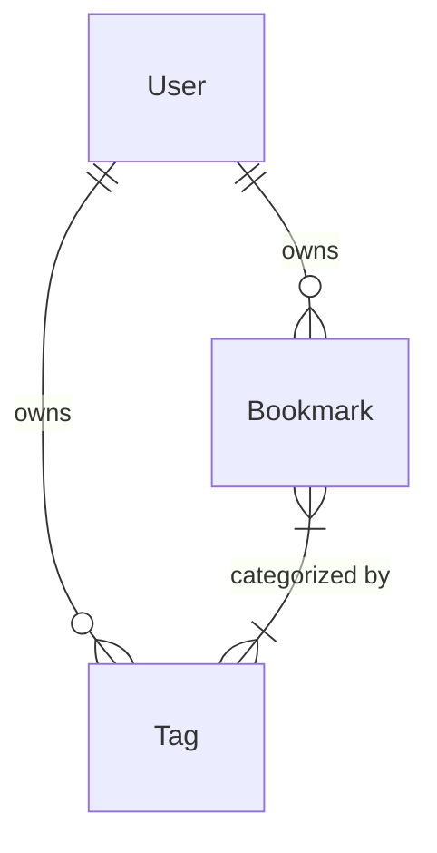

<div align="center">

# 🔖 Tag-Based Bookmark Manager API

[](https://fastapi.tiangolo.com/)
[](https://www.python.org/)
[](https://www.sqlite.org/index.html)
[](https://jwt.io/)

**[🌐 Live Frontend Demo](https://bookmark-manager-api.netlify.app)** | **[📖 Swagger Docs](https://tag-based-bookmark-manager-api.onrender.com/docs)** | **[🚀 Postman Docs](https://documenter.getpostman.com/view/25887507/2sBXqDsP5g)**

A modern, fast, and secure API to store, manage, and categorize personal bookmarks using custom tags. Built with absolute focus on data isolation, security, and developer experience.

</div>

---

## ✨ Features
* **🔒 Secure Authentication:** JWT-based stateless authentication with `bcrypt` password hashing.
* **🛡️ Data Isolation:** Strict ownership validation ensures users can only access their own data.
* **🏷️ Dynamic Tagging:** Find-or-create tag logic natively handles case-insensitivity and whitespace stripping.
* **⚡ Blazing Fast:** Built on FastAPI, leveraging Pydantic V2 for schema validation.
* **🧩 Modular & Extensible:** Clean architecture separating routers, schemas, models, and dependencies.

---

## 🚀 Quick Start

### 1. Requirements
Ensure you have Python 3.8+ installed. 

### 2. Installation
Clone the repository, navigate into the project root, and install the dependencies:
```bash
pip install -r requirements.txt
```

### 3. Start the Server
Launch the development server via Uvicorn. The SQLite database will be created automatically.
```bash
python -m uvicorn main:app --host 127.0.0.1 --port 8000 --reload
```

### 4. Access the API
- **Base URL:** `http://127.0.0.1:8000`
- **Interactive Swagger UI:** [http://127.0.0.1:8000/docs](http://127.0.0.1:8000/docs)
- **ReDoc Documentation:** [http://127.0.0.1:8000/redoc](http://127.0.0.1:8000/redoc)

> **Pro Tip:** Import the included `postman_collection.json` into Postman to instantly test all endpoints! It includes an auto-login script that automatically captures and configures your Bearer token.

---

## 🗄️ Architecture (ERD)

The database enforces a strict hierarchical structure, ensuring that Bookmarks and Tags are securely bound to their respective owners.



---

## 📖 API Reference

### 🔐 1. Authentication
| Method | Endpoint | Description | Auth Required |
| :---: | :--- | :--- | :---: |
| <kbd>POST</kbd> | `/auth/register` | Register a new user account. Returns user details without password. | ❌ |
| <kbd>POST</kbd> | `/auth/login` | Authenticate user via username (email) and password. Returns JWT token. | ❌ |

### 🔖 2. Bookmarks
| Method | Endpoint | Description | Auth Required |
| :---: | :--- | :--- | :---: |
| <kbd>POST</kbd> | `/bookmarks/` | Create a new bookmark and auto-generate related tags. | 🔑 |
| <kbd>GET</kbd> | `/bookmarks/` | Retrieve all owned bookmarks. Ordered by newest (`id.desc`). | 🔑 |
| <kbd>GET</kbd> | `/bookmarks/{id}` | Retrieve a specific bookmark by its ID. | 🔑 |
| <kbd>PUT</kbd> | `/bookmarks/{id}` | Partially update a bookmark and optionally replace tags. | 🔑 |
| <kbd>DELETE</kbd>| `/bookmarks/{id}` | Permanently delete a bookmark. | 🔑 |

### 🏷️ 3. Tags
| Method | Endpoint | Description | Auth Required |
| :---: | :--- | :--- | :---: |
| <kbd>POST</kbd> | `/tags/` | Create a new tag manually. | 🔑 |
| <kbd>GET</kbd> | `/tags/` | Retrieve all tags owned by the authenticated user. | 🔑 |
| <kbd>PUT</kbd> | `/tags/{id}` | Rename an existing tag. | 🔑 |
| <kbd>DELETE</kbd>| `/tags/{id}` | Permanently delete a tag. | 🔑 |

---

## 💻 Code Examples

<details>
<summary><b>1. Register a New User</b></summary>

**Request:** `POST /auth/register`
```json
{
  "email": "user@example.com",
  "password": "securepassword123"
}
```

**Response:** `201 Created`
```json
{
  "email": "user@example.com",
  "id": 1,
  "is_active": true
}
```
</details>

<details>
<summary><b>2. Create a Bookmark with Tags</b></summary>

*Requires Header:* `Authorization: Bearer <your_jwt_token>`

**Request:** `POST /bookmarks/`
```json
{
  "title": "FastAPI Docs",
  "url": "https://fastapi.tiangolo.com/",
  "description": "The official FastAPI documentation.",
  "tags": ["python", "api", "framework"]
}
```

**Response:** `201 Created`
```json
{
  "title": "FastAPI Docs",
  "url": "https://fastapi.tiangolo.com/",
  "description": "The official FastAPI documentation.",
  "id": 1,
  "user_id": 1,
  "created_at": "2023-10-14T10:05:00.000000",
  "updated_at": "2023-10-14T10:05:00.000000",
  "tags": [
    {
      "name": "python",
      "id": 1,
      "created_at": "2023-10-14T10:05:00.000000",
      "updated_at": "2023-10-14T10:05:00.000000"
    },
    {
      "name": "api",
      "id": 2,
      "created_at": "2023-10-14T10:05:00.000000",
      "updated_at": "2023-10-14T10:05:00.000000"
    }
  ]
}
```
</details>

<details>
<summary><b>3. Partially Update a Bookmark</b></summary>

*Requires Header:* `Authorization: Bearer <your_jwt_token>`

**Request:** `PUT /bookmarks/1`
```json
{
  "title": "FastAPI Official Documentation"
}
```

**Response:** `200 OK`
```json
{
  "title": "FastAPI Official Documentation",
  "url": "https://fastapi.tiangolo.com/",
  "description": "The official FastAPI documentation.",
  ...
}
```
*Notice how fields omitted from the request (like `url`, `description`, and `tags`) remain untouched!*
</details>
